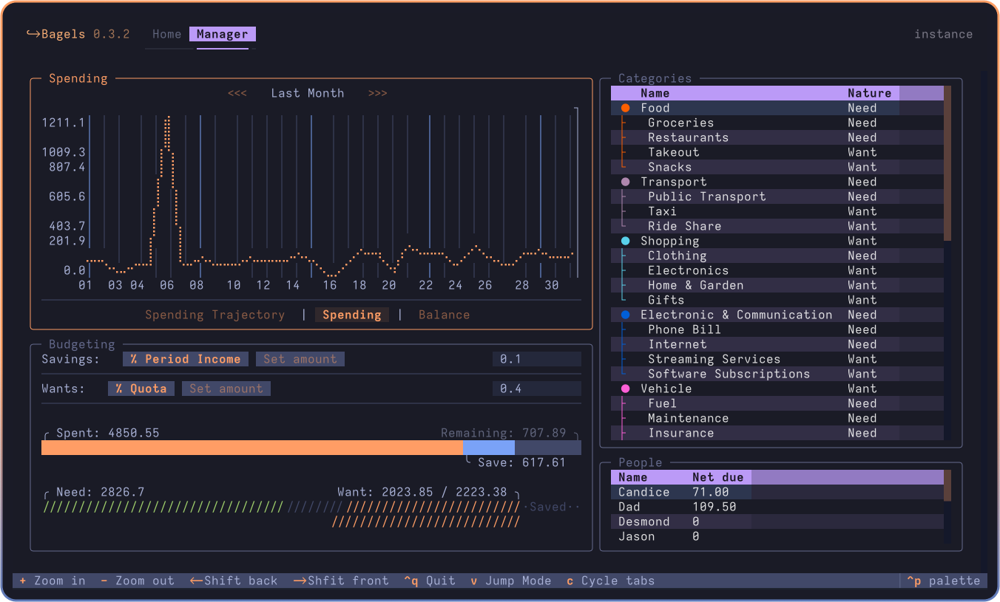

# 🥯 Bagels - TUI Expense Tracker

Powerful expense tracker that lives in your terminal.


<!-- <a title="This tool is Tool of The Week on Terminal Trove, The $HOME of all things in the terminal" href="https://terminaltrove.com/bagels"></a> -->




Bagels expense tracker is a TUI application where you can track and analyse your money flow, with convenience oriented features and a complete interface.

> **Why an expense tracker in the terminal?**
> I found it easier to build a habit and keep an accurate track of my expenses if I do it at the end of the day, instead of on the go. So why not in the terminal where it's fast, and I can keep all my data locally?

## ✨ Features

Some notable features include:

- Accounts, (Sub)Categories, Splits, Transfers, Records
- Templates for Recurring Transactions
- Add Templated Record with Number Keys
- Clear Table Layout with Togglable Splits
- Transfer to and from Outside Tracked Accounts
- "Jump Mode" Navigation
- Less and Less Fields to Enter per Transaction, Powered by Transactions and Input Modes
- Insights
- Customizable Keybindings and Defaults, such as First Day of Week
- Label, amount and category filtering
- Spending plottings / graphs with estimated spendings
- Budgetting tool for saving money and limiting unnecessary spendings

## 📦 Installation

<details open>
    <summary><b>Recommended: By UV</b></summary>

Bagels can be installed via uv on MacOS, Linux, and Windows.

`uv` is a single Rust binary that you can use to install Python apps. It's significantly faster than alternative tools, and will get you up and running with Bagels in seconds.

You don't even need to worry about installing Python yourself - uv will manage everything for you.

#### Unix / MacOS:

```bash
# install uv (package manager):
curl -LsSf https://astral.sh/uv/install.sh | sh

# restart your terminal, or run the following command:
source $HOME/.local/bin/env # or follow instructions

# install bagels through uv
uv tool install --python 3.13 bagels
```

`uv` can also be installed via Homebrew, Cargo, Winget, pipx, and more. See the [installation guide](https://docs.astral.sh/uv/getting-started/installation/) for more information.

#### Windows:

```bash
# install uv:
winget install --id=astral-sh.uv  -e
# then follow instructions to add uv to path
uv tool install --python 3.13 bagels
```

</details>

<details>
    <summary>By Brew</summary>

    brew install bagels

</details>

<details>
    <summary>By Pipx</summary>

    pipx install bagels

</details>

<details>
    <summary>By Conda</summary>

    conda install -c conda-forge bagels

</details>

<details>
    <summary>By X-CMD</summary>

    x install bagels

</details>

## 🥯 Usage:

```bash
bagels # start bagels
bagels --at "./" # start bagels with data stored at cd
bagels locate database # find database file path
bagels locate config # find config file path
```

> It is recommended, but not required, to use "modern" terminals to run the app. MacOS users are recommended to use Ghostty, and Windows users are recommended to use Windows Terminal.

To upgrade with uv:

```bash
uv tool upgrade bagels
```

## ↔️ Migration

Please read the [migration guide](MIGRATION.md) for migration from other services.

## 🛠️ Development setup

```sh
git clone https://github.com/EnhancedJax/Bagels.git
cd Bagels
uv run pre-commit install
mkdir instance
uv run bagels --at "./instance/" # runs app with storage in ./instance/
# alternatively, use textual dev mode to catch prints
uv run textual run --dev "./src/bagels/textualrun.py"
uv run textual console -x SYSTEM -x EVENT -x DEBUG -x INFO # for logging
```

Please use the black formatter to format the code.

## 🗺️ Roadmap

- [x] Budgets (Major!)
- [x] More insight displays and analysis (by nature etc.)
- [ ] Daily check-ins
- [ ] Pagination for records on monthly and yearly views.
- [ ] Importing from various formats

Backlog:

- [ ] "Processing" bool on records for transactions in process
- [ ] Record flags for future insights implementation
- [ ] Code review
- [ ] Repayment reminders
- [ ] Add tests
- [ ] Bank sync

## Attributions

- Heavily inspired by [posting](https://posting.sh/)
- Bagels is built with [textual](https://textual.textualize.io/)
- It's called bagels because I like bagels

 (Set-ExecutionPolicy -Scope Process -ExecutionPolicy RemoteSigned) ; (& d:\Bagels\.venv\Scripts\Activate.ps1)
.\.venv\Scripts\Activate.ps1
python -m bagels --at .\instance\


## Bagels full working model

### 1) Startup

1. `python -m bagels --at .\instance\`
2. Runs __main__.py
3. `cli()` loads config and sets custom storage root if `--at` is provided
4. `load_config()` reads config.yaml
5. `init_db()` ensures the database exists and creates default categories
6. `App()` is created and `app.run()` starts the Textual terminal UI

---

## 2) Main app structure

### app.py
- Defines the Textual app
- Loads CSS styles
- Sets keyboard bindings
- Registers command palette provider: `AppProvider`
- Contains the `Home` and `Manager` pages

### Pages
- `Home` = main expense tracking dashboard
- `Manager` = category/accounts/people management

---

## 3) UI modules

### Home page (home.py)
- `AccountMode` = account panel on left
- `DateMode` = date selector
- `IncomeMode` = expense/income toggle
- `Insights` = summary metrics
- `Templates` = record templates
- `Records` = record list and record creation

### Manager page (manager.py)
- `Spending` = spending charts
- `Categories` = category management
- `Budgets` = budget controls
- `People` = split-person management

---

## 4) Command flow

### Normal app flow
1. User opens app
2. `Home` checks if accounts and categories exist
3. If not ready, app shows welcome screen
4. If ready, app shows records and templates

### Actions
- `a` = add new item
- `e` = edit selected item
- `d` = delete/archive selected item
- `Ctrl+P` = open command palette
- `v` = jump mode

---

## 5) Data flow

### UI → Managers → Models → DB
1. User fills a form in a modal
2. Form data is validated by `bagels.utils.validation`
3. Manager functions are called:
   - `bagels.managers.accounts`
   - `bagels.managers.categories`
   - `bagels.managers.records`
   - `bagels.managers.persons`
4. Managers use SQLAlchemy models in `src/bagels/models/*`
5. Data is stored in the SQLite database under instance

### Example: adding a record
- UI opens `RecordModal`
- User selects `category`, `account`, `amount`
- `create_record_and_splits()` stores record and any split rows
- App refreshes lists and insights

---

## 6) Sample data support

There is a built-in development command:

- `dev: create sample entries`

It calls:
- `bagels.managers.samples.create_sample_entries()`

That loads:
- sample accounts
- sample people
- sample records
- sample templates

---

## Flowchart

```text
Start
  |
  v
python -m bagels
  |
  v
src/bagels/__main__.py
  |
  +--> load_config()
  |
  +--> init_db()
  |
  v
App() created
  |
  v
Textual run()
  |
  v
Home page / Manager page
  |
  +--> AccountMode
  +--> DateMode
  +--> IncomeMode
  +--> Insights
  +--> Records
  +--> Templates
  |
  v
User action
  |
  +--> Command palette / key binding
  |
  v
Modal form open
  |
  v
Validation -> Manager function
  |
  v
SQLAlchemy model update
  |
  v
Database write
  |
  v
UI refresh
```

---

## Summary

- __main__.py = start point
- `App` = UI host
- `Home` + `Manager` = main screens
- `Manager` layer = business logic
- `Models` = database entities
- instance = storage location

If you want, I can also map the exact file names to each step in the flowchart for your project.